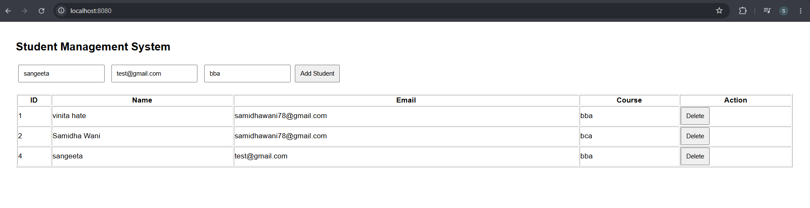
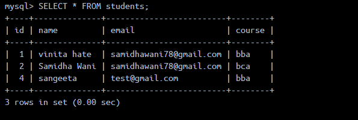

# 🎓 Student Management System - Dockerized 3-Tier Application

A containerized **Student Management System** built using **Python Flask, MySQL, HTML, CSS, JavaScript, Docker, and Docker Compose**. This project demonstrates a complete **3-tier architecture** where the frontend, backend, and database run in separate Docker containers.

---

## 📌 Project Overview

This application allows users to perform CRUD (Create, Read, Update, Delete) operations on student records through a web interface.

The project is fully containerized using Docker and orchestrated using Docker Compose.

---

## 🏗️ Architecture

```
                +---------------------+
                |      Frontend       |
                | HTML | CSS | JS     |
                |      (Nginx)        |
                +----------+----------+
                           |
                    REST API Calls
                           |
                           ▼
                +---------------------+
                |  Backend (Flask)    |
                | Python REST API     |
                +----------+----------+
                           |
                       SQL Queries
                           |
                           ▼
                +---------------------+
                |   MySQL Database    |
                +---------------------+
```

---

# 🚀 Features

- Add Student
- View Students
- Update Student Details
- Delete Student
- REST API using Flask
- MySQL Database
- Dockerized Backend
- Dockerized Frontend
- Dockerized MySQL
- Docker Compose Orchestration
- Persistent Database Storage using Docker Volumes

---

# 🛠️ Tech Stack

## Frontend

- HTML5
- CSS3
- JavaScript
- Nginx

## Backend

- Python
- Flask
- Flask-CORS
- PyMySQL

## Database

- MySQL 8

## DevOps

- Docker
- Docker Compose

---

# 📂 Project Structure

```
student-management-system/
│
├── backend/
│   ├── app.py
│   ├── requirements.txt
│   └── Dockerfile
│
├── frontend/
│   ├── index.html
│   ├── style.css
│   ├── script.js
│   └── Dockerfile
│
├── database/
│   └── init.sql
│
├── docker-compose.yml
│
└── README.md
```

---

# 🐳 Docker Containers

| Container | Purpose |
|------------|---------|
| frontend | Serves the frontend using Nginx |
| backend | Runs the Flask REST API |
| mysql | Stores student records |

---

# 🌐 Docker Networking

Docker Compose creates a private bridge network that allows containers to communicate using service names.

Example:

```
Backend → mysql
```

Instead of using an IP address, the backend connects using:

```python
host="mysql"
```

---

# 💾 Docker Volume

A Docker volume is used to persist MySQL data.

```
mysql-data
```

This ensures that student records are not lost when containers are recreated.

---

# 🔥 REST API Endpoints

## Get All Students

```
GET /students
```

---

## Add Student

```
POST /students
```

Example Request

```json
{
    "name":"John",
    "email":"john@gmail.com",
    "course":"BCA"
}
```

---

## Update Student

```
PUT /students/{id}
```

---

## Delete Student

```
DELETE /students/{id}
```

---

# ▶️ Running the Project

## Clone the Repository

```bash
git clone https://github.com/yourusername/student-management-system.git
```

```
cd student-management-system
```

---

## Build Containers

```bash
docker compose build
```

---

## Start the Application

```bash
docker compose up
```

or

```bash
docker compose up -d
```

---

## Stop the Application

```bash
docker compose down
```

---

# 🌍 Access the Application

Frontend

```
http://localhost:8080
```

Backend API

```
http://localhost:5000/students
```

MySQL

```
localhost:3308
```

(Change the port if you configured a different one.)

---

# 📸 Screenshots

## Home Page



# Docker Containers


# Mysql Database



---

# 📚 What I Learned

Through this project I learned:

- Docker Fundamentals
- Writing Dockerfiles
- Docker Images
- Docker Containers
- Docker Compose
- Docker Networking
- Docker Volumes
- Multi-container Applications
- Flask REST APIs
- MySQL Integration
- Container Debugging
- Container Startup Dependencies
- Port Mapping
- Persistent Storage

---

# 🚧 Challenges Faced

During development, I encountered and resolved several real-world Docker issues:

- Backend container starting before MySQL was ready.
- Docker networking configuration.
- Port conflicts on the host machine.
- MySQL connection troubleshooting.
- Container startup sequencing.

These challenges helped me understand how multi-container applications behave in real-world environments.

---

# 🔮 Future Improvements

- User Authentication
- JWT Authentication
- Search Student
- Pagination
- Kubernetes Deployment
- CI/CD Pipeline using Jenkins or GitHub Actions
- Deploy on AWS

---

# 👩‍💻 Author

**Samidha Nitin Wani**

GitHub: https://github.com/yourusername

LinkedIn: https://linkedin.com/in/yourprofile

---

# ⭐ If you found this project useful, consider giving it a star on GitHub!
