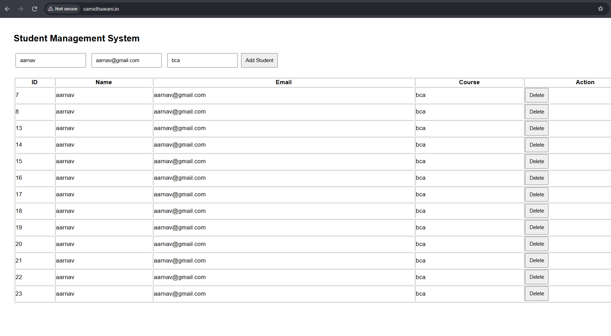
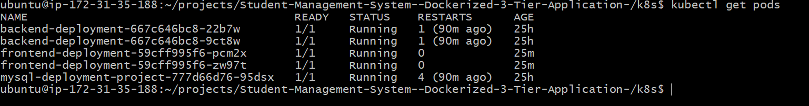
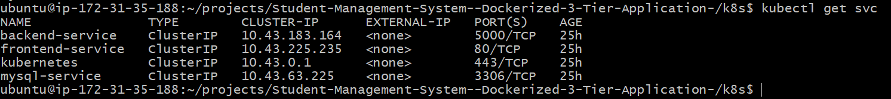
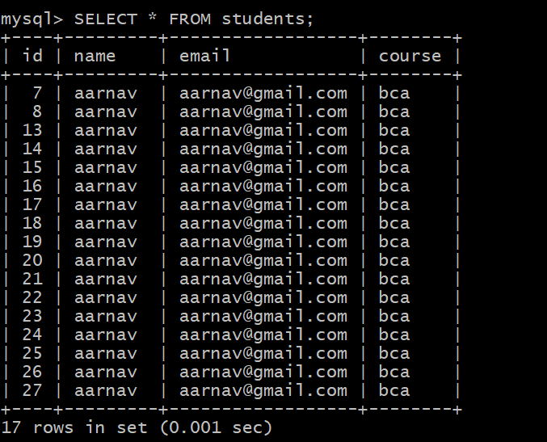
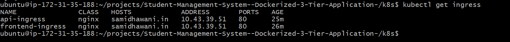
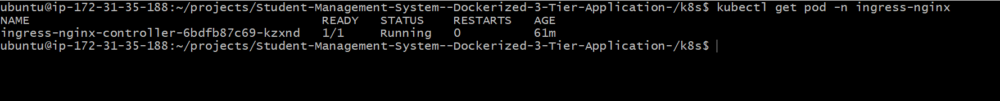

# Student-Management-system-3-tier-application-k3s-deployment 🚀

A production-style **3-tier Student Management System** deployed using **Docker, Kubernetes, and AWS EC2**.

This project demonstrates a complete cloud-native architecture where frontend, backend, and database components run as independent services using Kubernetes.

The application provides CRUD operations for managing student records through a web interface.

---

# Architecture Overview

```
                         Internet
                            |
                            |
                       AWS EC2 Instance
                            |
                    Kubernetes Ingress
                            |
          +-----------------+-----------------+
          |                                   |
          |                                   |
 Frontend Service                     Backend Service
          |                                   |
    Nginx Pod                         Flask API Pod
 HTML/CSS/JS                         Python REST API
                                              |
                                              |
                                      MySQL Service
                                              |
                                        MySQL Pod
                                              |
                                      Persistent Storage
                                             PVC
```

---

# Technology Stack

## Frontend

- HTML5
- CSS3
- JavaScript
- Nginx

## Backend

- Python
- Flask
- Flask REST API
- PyMySQL

## Database

- MySQL 8

## Containerization

- Docker
- Docker Images
- Docker Compose

## Orchestration

- Kubernetes
- k3s Kubernetes Distribution
- Kubernetes Deployments
- Kubernetes Services
- Kubernetes Ingress

## Cloud Platform

- AWS EC2

## Kubernetes Configuration

- ConfigMaps
- Secrets
- Persistent Volume Claims (PVC)

---

# Features

✅ Add Student Records  
✅ View Student Records  
✅ Update Student Information  
✅ Delete Student Records  
✅ REST API Backend  
✅ MySQL Database Integration  
✅ Dockerized Application  
✅ Kubernetes Deployment  
✅ Persistent Database Storage  
✅ Ingress Based Routing  
✅ Secure Configuration using Secrets  
✅ Cloud Deployment on AWS EC2  

---

# Project Structure

```
student-management-system/

│
├── backend/
│   ├── app.py
│   ├── requirements.txt
│   └── Dockerfile
│
├── frontend/
│   ├── index.html
│   ├── style.css
│   ├── script.js
│   └── Dockerfile
│
├── database/
│   └── init.sql
│
├── k8s/
│
│   ├── frontend-deployment.yaml
│   ├── frontend-service.yaml
│   │
│   ├── backend-deployment.yaml
│   ├── backend-service.yaml
│   │
│   ├── mysql-deployment.yaml
│   ├── mysql-service.yaml
│   │
│   ├── configmap.yaml
│   ├── secret.yaml
│   ├── pvc.yaml
│   └── ingress.yaml
│
├── docker-compose.yml
└── README.md
```

---

# Kubernetes Resources Used

| Resource | Purpose |
|----------|---------|
| Deployment | Manages application pods |
| Service | Provides internal communication between components |
| Ingress | Provides external HTTP routing |
| ConfigMap | Stores application configuration |
| Secret | Stores sensitive information |
| PVC | Provides persistent database storage |

---

# Kubernetes Architecture Flow

```
User Browser

      |
      |
      v

Ingress Controller

      |
      |
      +----------------+
      |                |
      v                v

Frontend Service   Backend Service

      |                |
      v                v

Frontend Pod       Backend Pod

                       |
                       |
                       v

                MySQL Service

                       |
                       |
                       v

                 MySQL Pod

                       |
                       |
                       v

                Persistent Volume
```

---

# Docker Networking

Docker Compose and Kubernetes provide service-based communication.

Instead of using container IP addresses, services communicate using DNS names.

Example:

Backend connects to MySQL:

```python
MYSQL_HOST=mysql-service
```

No hardcoded IP addresses are required.

---

# Persistent Storage

MySQL database uses Kubernetes Persistent Volume Claim.

Benefits:

- Database data survives pod restart
- Storage lifecycle is separated from containers
- Prevents data loss during redeployment

---

# Kubernetes Deployment on AWS EC2

## Install k3s

```bash
curl -sfL https://get.k3s.io | sh -
```

---

## Deploy Application

```bash
kubectl apply -f k8s/
```

---

## Check Running Pods

```bash
kubectl get pods
```

---

## Check Services

```bash
kubectl get svc
```

---

## Check Ingress

```bash
kubectl get ingress
```

---

# Application Access

Frontend:

```
https://your-domain.com
```

Backend API:

```
https://your-domain.com/api/students
```

---

# Screenshots

## Application UI




## Kubernetes Pods




## Kubernetes Services




## MySQL Database




## Kubernetes Ingress




## Kubernetes Ingress Controller



---

# Challenges Faced & Solutions

## 1. Backend Starting Before MySQL

### Problem

Backend container started before MySQL database was ready.

### Solution

Implemented MySQL connection retry logic in Flask application.

---

## 2. Kubernetes Image Issues

### Problem

Pods failed due to image pulling errors.

### Solution

Debugged Kubernetes events and verified container images.

---

## 3. Service Communication Issues

### Problem

Frontend and backend services were unable to communicate.

### Solution

Configured Kubernetes Services and DNS-based communication.

---

## 4. External Browser Access

### Problem

Application was not accessible externally.

### Solution

Configured Kubernetes Ingress controller and domain routing.

---

# What I Learned

Through this project I learned:

- Docker containerization
- Writing Dockerfiles
- Docker Images
- Docker Compose
- Container Networking
- Kubernetes Architecture
- Kubernetes Deployments
- Kubernetes Services
- Kubernetes Ingress
- ConfigMaps
- Secrets Management
- Persistent Storage
- Cloud Deployment
- Kubernetes Debugging
- Production-style Application Deployment

---

# Future Improvements

- Jenkins CI/CD Pipeline
- GitHub Actions Workflow
- Helm Charts
- Prometheus & Grafana Monitoring
- AWS EKS Deployment
- HTTPS using Cert Manager
- Horizontal Pod Autoscaling
- Application Authentication

---

# Author

**Samidha Nitin Wani**

GitHub:
https://github.com/samidha1-1

LinkedIn:
https://www.linkedin.com/in/samidha-wani-411549285/

---

⭐ If you found this project useful, consider giving it a star on GitHub!
